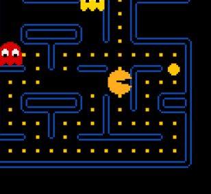
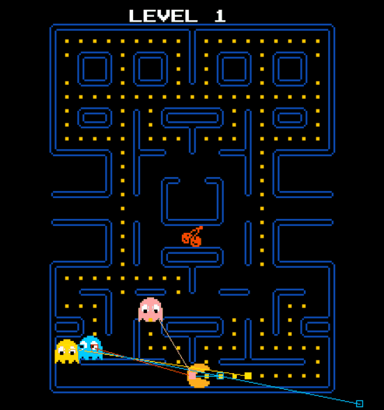

#  Pac-Man Game
<p align="center">
  
</p>


This a little Pac-Man game implemented using SDL2 library in C++.

[简体中文](docs/README-zh.md)

## Features!

#### In Game:

- Use the up, down, left and right arrow keys on the keyboard to control the character (the "pac-man"). Eat all beans on the screen while avoiding the chase of little ghosts, and the "Power Pellet" may save your life in danger!



- Don't forget to eat special food for bonus. The harder the level, the higher the bonus score!


#### In Code:

- All textures in the game are 8-bit pixel style (can be found in [here](https://github.com/Criheacy/Pac-Man-Game/tree/main/src/res/image)), which simulates the poor hardware conditions clever solutions of Pac-Man games of the last century.


- The ghosts AI is similar with that of the original version. It’s an excellent cooperation strategy of enemies, only use very simple algorithm but makes the ghosts chasing the Pacman efficiently. (rendered in debug mode with Gizmos on)




## How can I play it?

Just download the [release](https://github.com/Criheacy/Pac-Man-Game/releases/tag/v0.1.0) and execute `Pac-Man.exe` (or `Pac-Man` in Linux).


## How to build the project?

First, you have to make sure that you have installed SDL2 and SDL2-image libraries.

For Linux users, you can installed it with `sudo apt-get install libsdl2-dev libsdl2-image-dev`. Just one line is enough.

For Windows and Mac users, download **Development Libraries** from [SDL2 website](http://www.libsdl.org/download-2.0.php), set system path and configure you IDE. SDL2-image library is similar. For more information, just follow [Lazy Foo's Tutorial](https://lazyfoo.net/tutorials/SDL/01_hello_SDL/index.php).


After SDL2 is installed, use cmake to build this project.

For Linux users, execute following commands in your working directory:

```
mkdir build
cd build
cmake ../src
```

For Windows users, just build it in your IDE, it will automatically configures for building project.

